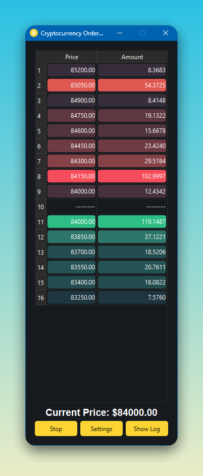

# Cryptocurrency Order Book Visualizer



## Overview

This project is a real-time cryptocurrency order book visualizer that fetches data from the Binance API, displays it in a user-friendly interface, and sends Telegram notifications for significant events like large order placements (walls) and order cancellations (spoofing).


## Quick Start

```bash
# Clone the repository
git clone https://github.com/yourusername/crypto-orderbook-visualizer.git
cd crypto-orderbook-visualizer

# Create and activate virtual environment
python -m venv venv

# Windows
venv\Scripts\activate
# Unix/MacOS
source venv/bin/activate

# Install dependencies
pip install -r requirements.txt

# Configure Telegram (edit orderbook.py)
# Replace YOUR_TOKEN and YOUR_CHAT_ID with your values
sed -i 's/TOKEN = ""/TOKEN = "YOUR_TOKEN"/' orderbook.py
sed -i 's/CHAT_ID = ""/CHAT_ID = "YOUR_CHAT_ID"/' orderbook.py

# Run the application
python orderbook.py
```

## Development Setup

```bash
# Install development dependencies
pip install -r requirements-dev.txt

# Run tests
python -m pytest

# Run linter
flake8 .

# Format code
black .
```

// ...existing features and screenshots sections...

## Contributing

1. Fork the repository
2. Create your feature branch (`git checkout -b feature/amazing-feature`)
3. Commit your changes (`git commit -m 'Add some amazing feature'`)
4. Push to the branch (`git push origin feature/amazing-feature`)
5. Open a Pull Request

## Project Structure

```
crypto-orderbook-visualizer/
│
├── orderbook.py          # Main application file
├── requirements.txt      # Project dependencies
├── assets/              # Screenshots and images
│   ├── orderbook.png
│   ├── settings.png
│   └── ...
│
└── README.md            # Project documentation
```
